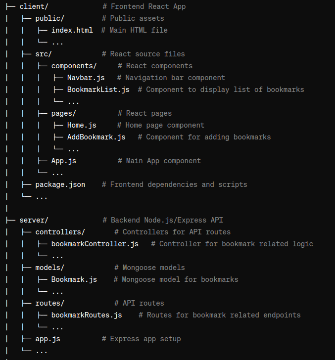
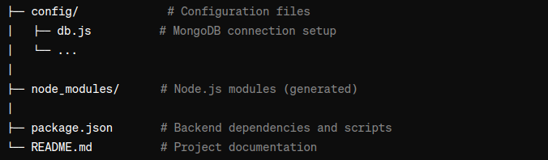

# Bookmarks

[LiveLink](https://bookmarks.jeremycasanova.me/)

# Technologies used

Github
MongoDB
VsCode
Webpack
Babbel
Gulp
Mongoose
Express
React
Node
Html
Scss
Css
Javascript

# Reference Materials

[React Dev](https://react.dev/)
[MDN](https://developer.mozilla.org/en-US/)
[W3Schools](https://www.w3schools.com/sass/default.asp)
[Big Poppa Code Channel](https://www.youtube.com/@bigpoppacode)
[Geeks for Geeks](https://www.geeksforgeeks.org/)
[Npm Docs](https://docs.npmjs.com/)
[Npm+runKit](https://npm.runkit.com/?q=)

# Pseudo files and folder structure

# Setup Instructions

# create .env and add link/password from MongoDB to file.

# npm i(to install dependencies)

# npm run build(to run website build)

# npm run client(to open in browser)

# npm run start(to start server)

----Important----
"This MERN app uses bcryptjs instead of bcrypt. Change according to user standard. NOTE: Anytime you make a change, you must delete the build and re-follow steps above in order to see a reflection on the server, i.e., CSS, scss, buttons, etc."
